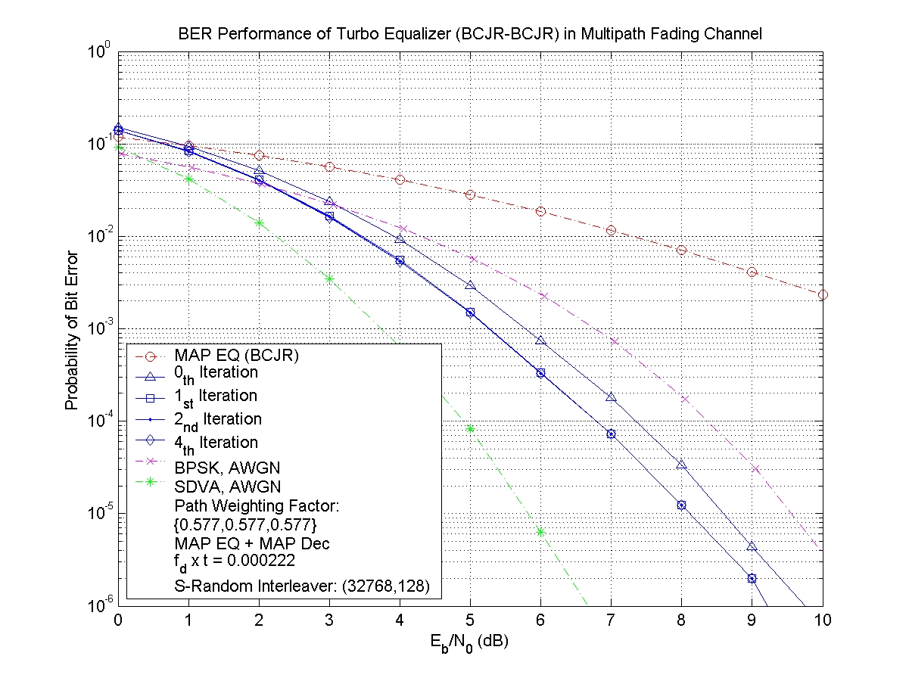
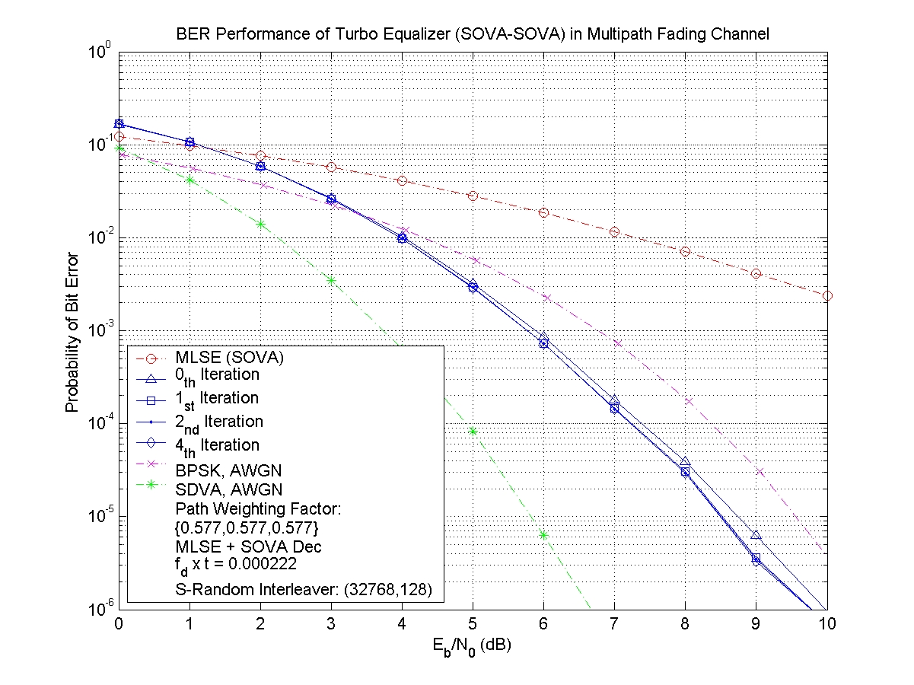
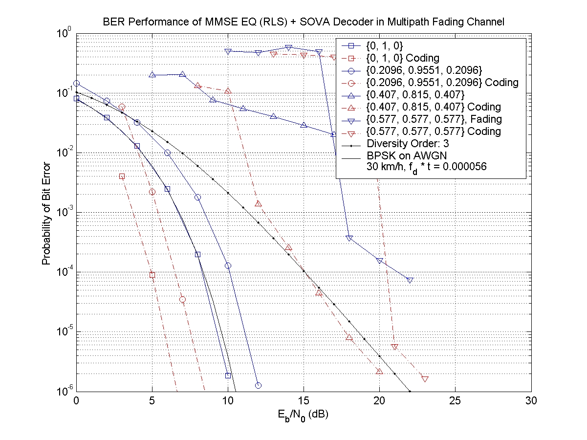
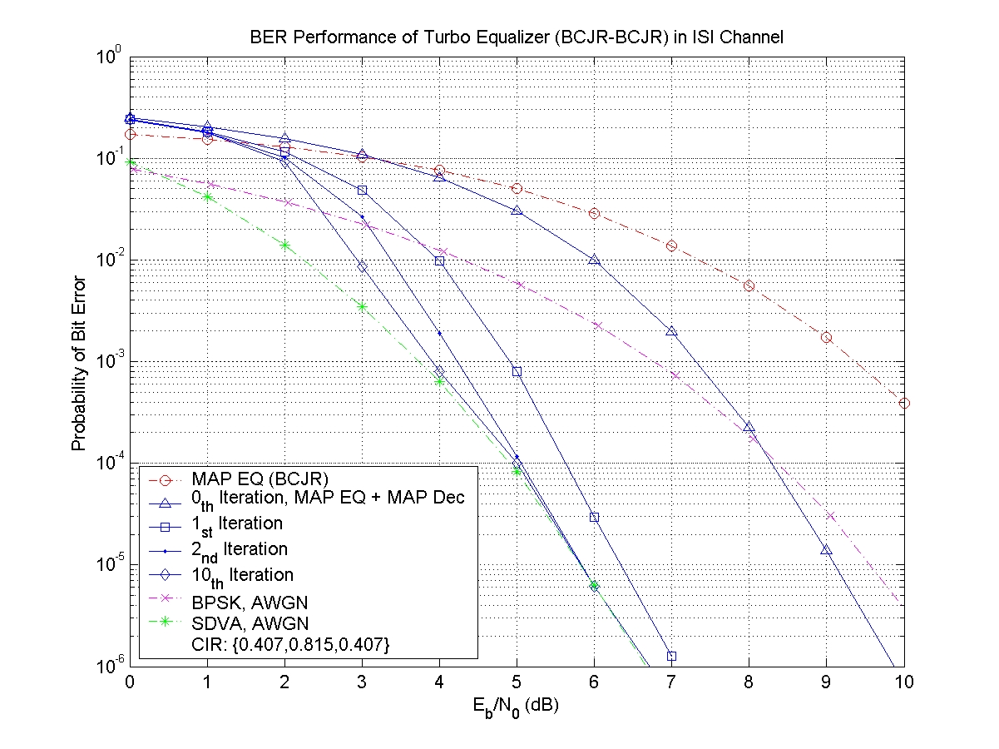
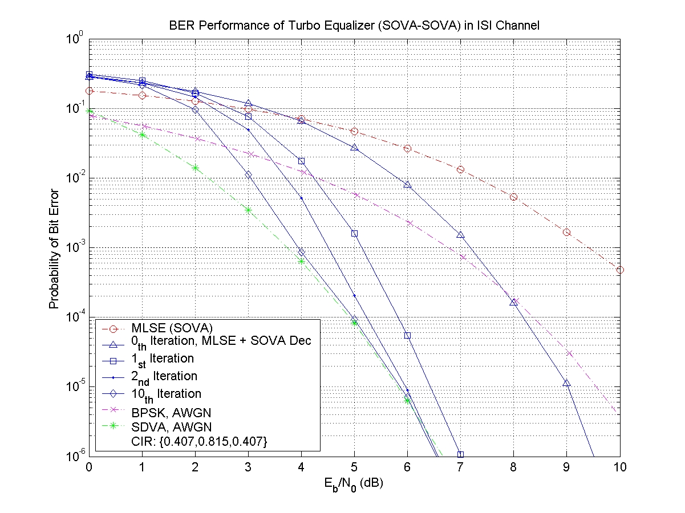

### Turbo Equalization

This project evaluate the performance of turbo equalizers in both ISI channel and multipath fading channel

* Channel coding: (2, 1, 2) Convolutional code
* Interleaver: S-random interleaver with S=16
* Equalizer + Channel Decoder: BCJR + BCJR in multipath fading channel
* Equalizer + Channel Decoder: MLSE + SOVA in multipath fading channel
* Equalizer + Channel Decoder: Kalman Filter (RLS) + SOVA in multipath fading channel
* Equalizer + Channel Decoder: BCJR + BCJR in ISI channel
* Equalizer + Channel Decoder: MLSE + SOVA in ISI channel

#### Performance Evaluation

